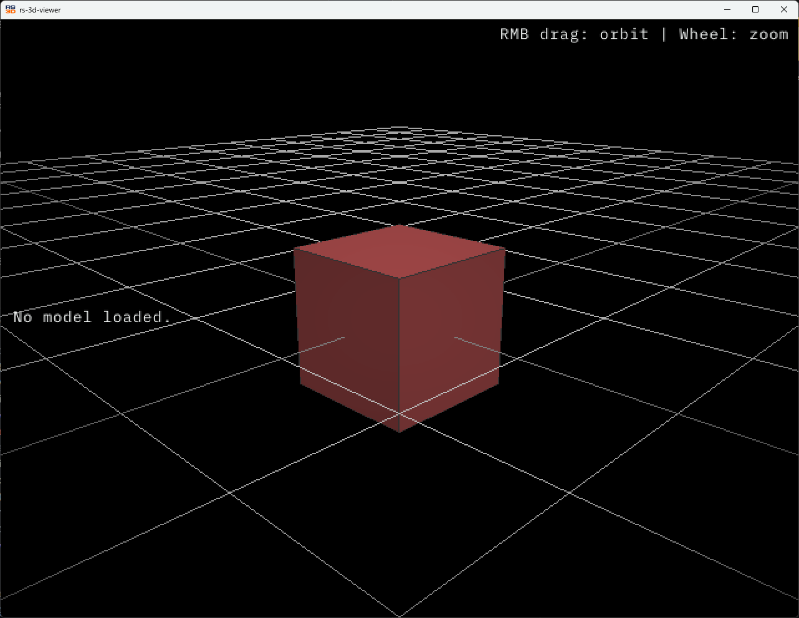
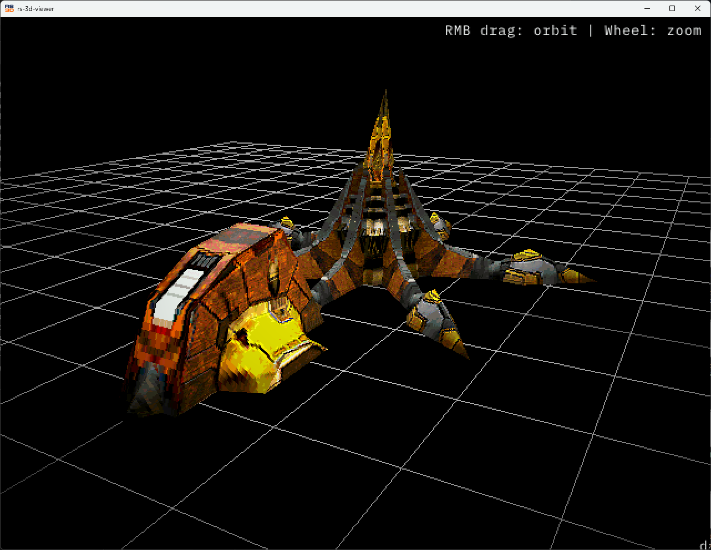

# RS-3D Viewer
Very simple 3D model viewer written in Rust. Created for learning purposes.

<table>
<tr>
    <td>
        
    </td>
    <td>
        
    </td>
</tr>
</table>

```
git clone https://github.com/dschrubba/rs-3d-viewer.git
cd rs-3d-viewer
cargo build
// Drag and Drop a 3D model file at the executable
```
